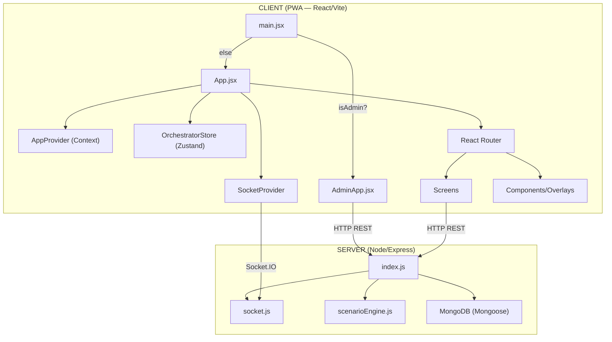
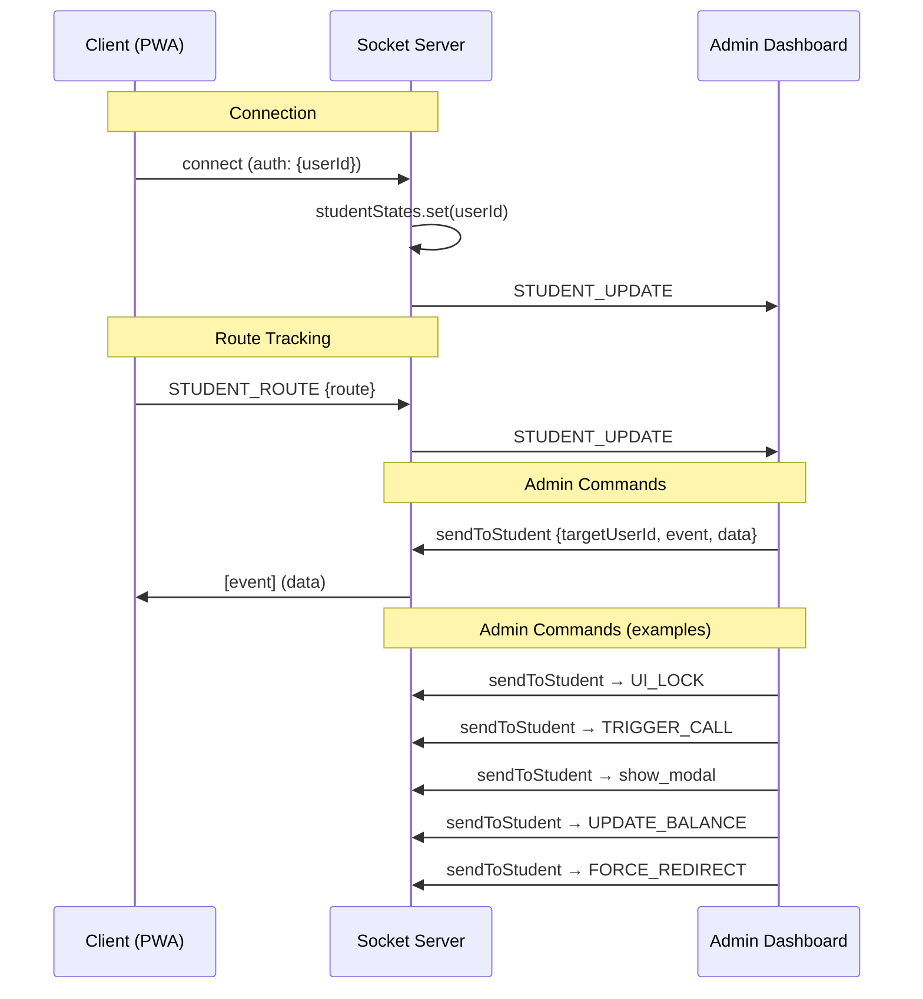

# LUMEN Bank — Architecture Plan

> **Version**: 2.0 · **Date**: 2026-05-12
> **Purpose**: Single source of truth for all development, debugging, and feature work.

---

## 1. System Overview



### Tech Stack

| Layer | Technology |
|---|---|
| Frontend | React 18, Vite, Framer Motion, Tailwind CSS |
| State | `AppContext` (React Context) + `orchestratorStore` (Zustand) |
| Real-time | Socket.IO Client ↔ Socket.IO Server |
| Styling | Tailwind CSS + CSS custom properties (dark mode via `.dark` class) |
| PWA | `vite-plugin-pwa` (service worker, manifest) |
| Backend | Express.js, Mongoose, MongoDB Atlas |
| Deployment | Netlify (frontend) / render.com or similar (server) |

---

## 2. File Structure Map

```
lumen-bank/
├── index.html                   # Entry point, viewport meta, PWA meta tags
├── vite.config.js               # Vite + PWA plugin config
├── tailwind.config.js           # Tailwind tokens (lumen-* colors, font stack)
├── package.json
│
├── server/                      # Backend (runs separately on port 5001)
│   ├── index.js                 # Express app, REST API routes, MongoDB connection
│   ├── socket.js                # Socket.IO server: rooms, events, admin commands
│   ├── scenarioEngine.js        # JSON-based trigger system for transfers
│   ├── models.js                # Mongoose schemas: User, Card, Transaction, Document
│   └── models/
│       ├── credit.js            # CreditRequest schema
│       └── chat.js              # Message schema
│
├── src/
│   ├── main.jsx                 # React root: admin/client routing, SW registration
│   ├── App.jsx                  # Client shell: Router, BottomNav, Overlays, PWAInstall
│   ├── AdminApp.jsx             # Admin shell: header + AdminPanel
│   │
│   ├── context/
│   │   ├── AppContext.jsx       # Global state: user, cards, txs, auth, i18n, dark mode
│   │   └── SocketContext.jsx    # Socket event → Zustand bridge
│   │
│   ├── store/
│   │   └── orchestratorStore.js # Zustand: uiLock, balance, callState, forceRedirect
│   │
│   ├── services/
│   │   └── socketService.js     # Socket.IO singleton + event listeners
│   │
│   ├── hooks/
│   │   └── useStudentTracker.js # Emits route/balance/action events to admin
│   │
│   ├── assets/
│   │   └── Icons.jsx            # Centralized icon exports (lucide-react)
│   │
│   ├── api/
│   │   └── user.js              # Axios wrapper (currently unused by most screens)
│   │
│   ├── i18n/
│   │   ├── en.json              # English translations
│   │   └── fr.json              # French translations
│   │
│   ├── screens/
│   │   ├── Onboarding.jsx       # Registration flow: lang → form → PIN → confirm → permissions
│   │   ├── PinLogin.jsx         # PIN entry + WebAuthn/FaceID biometric
│   │   ├── Home.jsx             # Dashboard: balance, card carousel, quick actions, txs
│   │   ├── Cards.jsx            # Card list + detail (flip, block, Apple Wallet, smart contracts)
│   │   ├── Crypto.jsx           # Crypto portfolio with simulated price ticker
│   │   ├── Transfers.jsx        # Card/IBAN transfer with OTP + slide-to-pay
│   │   ├── TopUp.jsx            # Card top-up flow
│   │   ├── Withdraw.jsx         # Withdrawal flow
│   │   ├── History.jsx          # Transaction history with filters
│   │   ├── Utilities.jsx        # Bill payments (phone, internet, etc.)
│   │   ├── Credit.jsx           # Loan calculator + application → admin approval
│   │   ├── Chat.jsx             # Real-time chat with custom keyboard
│   │   ├── Profile.jsx          # Settings: security toggles, KYC/AML forms, dark mode
│   │   └── admin/
│   │       ├── AdminPanel.jsx       # Tabbed admin: Users, Txs, Credits, Docs, Chat, Controls
│   │       └── ObservationDashboard.jsx  # Live student monitoring + command panel
│   │
│   ├── components/
│   │   ├── UILockOverlay.jsx    # Full-screen lock triggered by admin
│   │   ├── VoiceCallOverlay.jsx # Simulated incoming call with DTMF
│   │   └── ModalOverlay.jsx     # OTP/Warning/Error modals from scenario engine
│   │
│   └── index.css                # CSS: variables, dark mode overrides, animations
```

---

## 3. State Management

### 3.1 AppContext (React Context)

Primary state store for **user-facing data**. Persisted to `localStorage`.

| State | Type | Source | Persistence |
|---|---|---|---|
| `user` | `{ name, email, balance, btc, eth, usdt }` | Registration / localStorage | ✅ `lumen_user_data` |
| `cards` | `Card[]` | Hardcoded defaults + localStorage | ✅ `lumen_cards` |
| `transactions` | `Transaction[]` | Hardcoded defaults + localStorage | ✅ `lumen_txs` |
| `isAuthenticated` | `boolean` | PIN verification | ❌ session only |
| `onboardingDone` | `boolean` | Registration completion | ✅ `lumen_onboarded` |
| `darkMode` | `boolean` | Toggle | ✅ `lumen_dark` |
| `lang` | `'en' \| 'fr'` | Selection | ✅ `lumen_lang` |
| `biometric` | `boolean` | Toggle | ✅ `lumen_bio` |
| `kycStatus` | `'none' \| 'pending' \| 'verified' \| 'rejected'` | Form submission | ✅ `lumen_kyc` |
| `amlStatus` | `'none' \| 'pending' \| 'verified' \| 'rejected'` | Form submission | ✅ `lumen_aml` |
| `creditStatus` | `'none' \| 'pending' \| 'approved' \| 'rejected'` | Form submission | ❌ session only |

**Key Methods**:
- `login(pin)` — Verifies against `lumen_pin` in localStorage
- `logout()` — Clears session, removes `lumen_user_id`
- `completeOnboarding(pin, lang, regForm)` — Saves everything, creates userId
- `bypassOnboarding()` — Skips registration for returning users
- `addTransaction(tx)` — Prepends to transaction list
- `updateCard(id, data)` — Partial card update

### 3.2 OrchestratorStore (Zustand)

Handles **admin-driven remote control** state. NOT persisted.

| State | Type | Source |
|---|---|---|
| `uiLock` | `boolean` | Socket event `UI_LOCK` |
| `balance` | `number` | Socket event `UPDATE_BALANCE` |
| `forceRedirectPath` | `string \| null` | Socket event `FORCE_REDIRECT` |
| `callState` | `object \| null` | Socket event `TRIGGER_CALL` |
| `uiPermissions` | `object` | Socket event `UI_PERMISSIONS` |

### 3.3 Dual-State Problem

> [!WARNING]
> `balance` exists in both `AppContext.user.balance` AND `orchestratorStore.balance`.
> The Home screen reads from `AppContext.user.balance` (hardcoded default `12450.80`).
> Admin balance updates go to `orchestratorStore.balance` which is **not reflected on Home**.
> This is a known desync issue that must be resolved.

---

## 4. Communication Layer

### 4.1 Socket.IO Architecture



### 4.2 Socket Events Reference

| Direction | Event | Payload | Purpose |
|---|---|---|---|
| C → S | `STUDENT_ROUTE` | `{ route }` | Track current page |
| C → S | `STUDENT_BALANCE` | `{ balance }` | Report balance |
| C → S | `STUDENT_ACTION` | `{ type, ...data }` | Track actions |
| C → S | `STUDENT_CALL_STATE` | `{ state }` | Report call status |
| C → S | `DTMF_INPUT` | `{ digit, callId }` | During simulated call |
| C → S | `VERIFY_CODE` | `{ code, callId }` | During call verification |
| C → S | `CALL_ENDED` | `{ callId }` | User hung up |
| C → S | `MODAL_CONFIRM/CANCEL/CLOSED` | `{ ... }` | Modal interaction |
| C → S | `chatMessage` | `{ text, sender }` | Chat message |
| S → C | `UI_LOCK` | `boolean` | Lock/unlock UI |
| S → C | `UPDATE_BALANCE` | `number` | Override displayed balance |
| S → C | `FORCE_REDIRECT` | `string (path)` | Navigate user |
| S → C | `TRIGGER_CALL` | `{ callerName, callerNumber }` | Simulate incoming call |
| S → C | `show_modal` | `{ modalType, title, message }` | Show OTP/warning/error |
| S → C | `CHAT_MESSAGE` | `{ text, sender }` | Admin chat reply |
| S → A | `STUDENT_LIST` | `Student[]` | Initial state dump |
| S → A | `STUDENT_UPDATE` | `Student` | State change |
| S → A | `STUDENT_OFFLINE` | `{ userId }` | Disconnection |
| S → A | `STUDENT_ACTION` | `{ userId, type, data }` | Action log |

### 4.3 REST API Endpoints

| Method | Path | Purpose |
|---|---|---|
| `GET` | `/admin/users` | List all users |
| `PATCH` | `/admin/user/:id` | Update user status |
| `PATCH` | `/admin/user/:id/balance` | Update user balance (DB) |
| `GET` | `/admin/transactions` | List all transactions |
| `PATCH` | `/admin/transaction/:id` | Update transaction status |
| `GET` | `/admin/documents` | List uploaded documents |
| `PATCH` | `/admin/document/:id` | Approve/reject document |
| `GET` | `/admin/credit-requests` | List credit requests |
| `PATCH` | `/admin/credit-request/:id` | Approve/reject credit |
| `POST` | `/admin/chat/send` | Admin sends chat message |
| `POST` | `/admin/seed` | Seed demo data |
| `GET` | `/api/chat` | Get chat messages |
| `POST` | `/api/chat` | User sends chat message |
| `POST` | `/api/register` | Register new user |
| `POST` | `/api/v1/transfers` | Create transfer |

---

## 5. Screen-by-Screen Logic

### 5.1 Onboarding (`Onboarding.jsx`)
- **Flow**: Language → Register Form → Create PIN → Confirm PIN → Permissions
- **Bypass**: "Already have an account? Log In" → `bypassOnboarding()`
- **Output**: Sets `lumen_pin`, `lumen_onboarded`, `lumen_user_id`, `lumen_user_data`

### 5.2 PinLogin (`PinLogin.jsx`)
- **Auto-biometric**: On mount, if `biometric === true`, triggers WebAuthn
- **PIN verification**: 6-digit → auto-submit → `login(pin)`
- **Lock**: After 3 failed attempts, `pinLocked = true`
- **FaceID flow**: `navigator.credentials.get()` → on success → reads `lumen_pin` → `login(savedPin)`

> [!IMPORTANT]
> The WebAuthn flow currently creates a credential request with `allowCredentials: []` (empty).
> This means NO credential is actually registered — it will always fall to the `.catch()`.
> To fix: Need to register a credential during onboarding and store its ID.

### 5.3 Home (`Home.jsx`)
- **Balance**: Reads from `AppContext.user.balance` (hardcoded default)
- **Card carousel**: Horizontal scroll of all cards (fiat, crypto, smart)
- **Quick actions**: Send, Top Up, Withdraw, Utilities, Credit
- **Transactions**: Last 5 from `AppContext.transactions`
- **Banner**: Auto-rotating promotional banners

### 5.4 Cards (`Cards.jsx`)
- **List view**: All cards with "+" button at top
- **Detail view**: Card flip (front/back with CVV), copy number, block/unblock
- **Smart contract**: 3-step progress block execution
- **Apple Wallet**: Calls `/.netlify/functions/generate-pass` (Netlify function)
- **Limits**: Internet purchases toggle, transfer limit display

### 5.5 Transfers (`Transfers.jsx`)
- **Modes**: Card-to-card or IBAN/Full Details
- **Source card**: Dropdown selector from fiat cards
- **Validation**: Card number (16 digits) or IBAN + sufficient balance
- **SlideToPay**: Draggable slider to authorize
- **OTP**: 6-digit modal with auto-generated code
- **Receipt**: Success screen with share via `navigator.share`

### 5.6 Credit (`Credit.jsx`)
- **Calculator**: Amount slider ($1K-$50K), term slider (3-60 months)
- **Rate**: Fixed 7.95%, auto-calculated monthly payment
- **Application**: `POST /api/credit/request` → sets `creditStatus = 'pending'`
- **Status banner**: Shows pending/approved/rejected based on admin action

> [!NOTE]
> When admin approves credit → server does `$inc: { balance: request.amount }` in MongoDB.
> But client balance comes from localStorage (AppContext), NOT from MongoDB.
> The credit approval does NOT create a credit card or reflect on client UI.

### 5.7 Chat (`Chat.jsx`)
- **Custom keyboard**: Alpha/Numeric/Symbol layouts rendered in-app
- **Real-time**: Socket event `CHAT_MESSAGE` from admin
- **Quick replies**: Pre-defined buttons for first interaction
- **Send**: Emits `chatMessage` via socket

### 5.8 Profile (`Profile.jsx`)
- **Security**: Biometric, 2FA, Notifications toggles
- **Verification**: KYC form (name, DOB, ID) → status badge; AML form (occupation, income)
- **Preferences**: Language (EN/FR), Dark mode
- **Sign out**: Calls `logout()`

> [!WARNING]
> **iOS Freeze Bug**: Previously caused by `backdrop-blur` and Framer Motion spring animations on toggles.
> Fix applied: Removed spring animations from Toggle component, removed backdrop-blur from headers.
> **Status**: Needs re-verification on iOS 17+ in standalone PWA mode.

---

## 6. Admin Panel Logic

### 6.1 AdminPanel (`AdminPanel.jsx`)
- **Tabs**: Users | Transactions | Credits | Documents | Chat | Controls
- **Users tab**: List with approve/block buttons + inline balance edit
- **Txs tab**: Table with complete/reject buttons
- **Credits tab**: Cards with approve/reject → triggers balance increment on server
- **Docs tab**: Cards with approve/reject → updates `kycStatus` if passport
- **Chat tab**: Textarea + user ID target → sends via REST API
- **Controls tab**: Renders `ObservationDashboard`

### 6.2 ObservationDashboard (`ObservationDashboard.jsx`)
- **Connection**: Force-disconnects client socket, reconnects as admin (`isAdmin: 'true'`)
- **Student list**: Table showing ID, current route, balance, online status
- **Activity log**: Real-time intercepted actions with timestamps
- **Command panel** (when student selected):
  - **UI Lock/Unlock**: `sendToStudent → UI_LOCK`
  - **Start/End Call**: `sendToStudent → TRIGGER_CALL / CALL_ENDED`
  - **Inject Modal**: OTP/Warning/Error → `sendToStudent → show_modal`
  - **Override Balance**: `sendToStudent → UPDATE_BALANCE`
  - **Force Navigation**: Buttons for /home, /cards, /crypto, /transfers, /history

---

## 7. Scenario Engine

Server-side middleware that intercepts `POST /api/v1/transfers` and evaluates JSON-defined triggers:

| Scenario | Condition | Action | Blocks? |
|---|---|---|---|
| `large_transfer_alert` | `amount >= 10000` | TRIGGER_CALL (Fraud Prevention) | ✅ 403 |
| `first_time_transfer` | `isFirstTransfer === true` | show_modal (OTP) | ❌ |
| `suspicious_recipient` | `recipientAccount in [flagged list]` | show_modal (Warning) | ❌ |
| `daily_limit_exceeded` | `dailyTotal > 50000` | show_modal (Error) | ✅ 403 |

---

## 8. Bug Tracker & Status

| # | Bug | Severity | Status | Fix |
|---|---|---|---|---|
| 1 | **Profile freeze on iOS PWA** | 🔴 Critical | ⚠️ Partially fixed | Removed `backdrop-blur` + spring animations. Needs re-test. |
| 2 | **Balance desync** (AppContext vs Zustand) | 🔴 Critical | ✅ Fixed | `useFiatBalance`, orchestrator sync, `GET /api/me` |
| 3 | **WebAuthn/FaceID not functional** | 🟡 High | ✅ Fixed | Credential registered in onboarding (`lumen_cred_id`) |
| 4 | **Credit approval doesn't reflect on client** | 🟡 High | ✅ Fixed | `CREDIT_STATUS` + `UPDATE_BALANCE` via socket/Ably |
| 5 | **Duplicate socket listeners** (socketService + SocketContext) | 🟡 High | ✅ Fixed | Handlers only in `socketService.js` |
| 6 | **socketService.js: `setForceRedirect` typo** | 🟡 Medium | ✅ Fixed | Uses `setForceRedirectPath` |
| 7 | **socket.js: duplicate `module.exports`** | 🟢 Low | ❌ Open | Line 206+208 both export same thing |
| 8 | **Cards "+" button is placeholder** | 🟡 Medium | ❌ Open | Shows toast only, no actual card creation flow |
| 9 | **Profile: `deferredPrompt` never provided** | 🟢 Low | ❌ Open | AppContext doesn't expose `installApp`/`deferredPrompt` |
| 10 | **api/user.js uses `process.env.REACT_APP_*`** | 🟢 Low | ❌ Open | Vite uses `import.meta.env.VITE_*` |
| 11 | **Admin URLs hardcoded to `localhost:5001`** | 🟡 Medium | ❌ Open | Should use env variable |
| 12 | **Credit endpoint mismatch** | 🟡 Medium | ❌ Open | Client posts to `/api/credit/request`, server expects at `/admin/credit-requests` |
| 13 | **Apple Wallet pass generation** | 🟡 Medium | ❌ Open | Requires Netlify function setup with signing certificates |

---

## 9. Stabilization Roadmap

### Phase 1: Critical Fixes (CURRENT)
- [ ] **Fix balance desync** — Make AppContext subscribe to orchestratorStore.balance
- [ ] **Fix socketService typo** — `setForceRedirect` → `setForceRedirectPath`
- [ ] **Remove duplicate socket listeners** — Keep only SocketContext, clean socketService
- [ ] **Fix credit flow** — Add socket event when admin approves, update client state
- [ ] **Re-test Profile on iOS** — Verify freeze is resolved

### Phase 2: Feature Completion
- [ ] **WebAuthn registration** — Add credential creation during onboarding
- [ ] **Card creation flow** — "+" button opens new card form
- [ ] **Admin → Client balance sync** — Admin balance update should push via socket AND update AppContext
- [ ] **Environment variables** — Replace all `localhost:5001` with `import.meta.env.VITE_API_URL`

### Phase 3: Production Polish
- [ ] **Apple Wallet** — Deploy Netlify function with signing certificates
- [ ] **PWA install prompt** — Implement `beforeinstallprompt` for Android
- [ ] **Error boundaries** — Wrap screens in React error boundaries
- [ ] **Loading states** — Add skeleton loaders for async data
- [ ] **Session timeout UX** — Show warning before auto-logout (5 min)

### Phase 4: Admin Hardening
- [ ] **Admin authentication** — Currently no auth required to access `/admin/*`
- [ ] **Chat real-time sync** — Admin chat should also use socket, not just REST
- [ ] **Scenario Engine UI** — Allow admin to enable/disable scenarios
- [ ] **Audit log persistence** — Store admin actions to MongoDB
