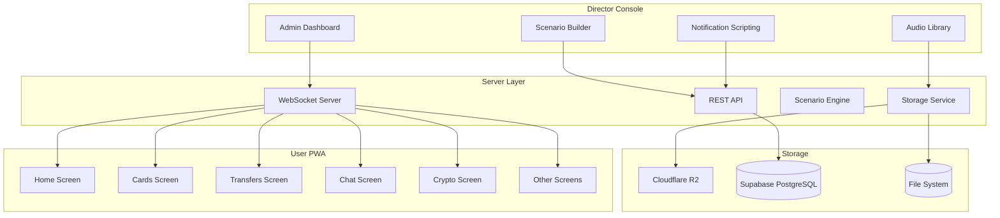
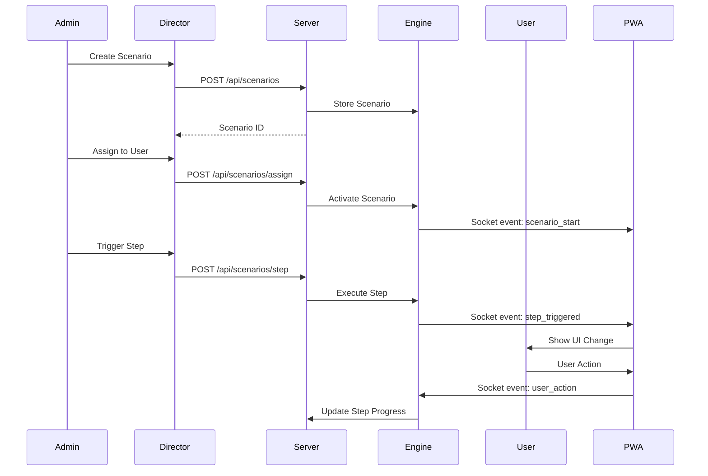

# LUMEN BANK - THEATER SCRIPT SYSTEM
## Complete Implementation Plan

**Version:** 1.0.0  
**Date:** 2026-05-23  
**Status:** Draft for Review

---

## 1. CONCEPT OVERVIEW

This is NOT an AI system. It is a **THEATER OF SCRIPTS** where:
- **Admin = Director/Screenwriter** - Creates and controls scenarios
- **User = Actor** - Follows the scripted path
- **Auto-responder = Pre-recorded files** - Professional audio files
- **Everything happens via scripts triggered by admin**

### Core Philosophy
> "Complex to Simple" - Admin thinks about the scenario, the system implements it. The user sees only the result - a perfect banking simulation.

---

## 2. CURRENT STATE ANALYSIS

### Existing Infrastructure
| Component | Status | Notes |
|-----------|--------|-------|
| [`DirectorApp.jsx`](src/DirectorApp.jsx:1) | Partial | Auth, routing, layout |
| [`DirectorNav.jsx`](src/components/director/DirectorNav.jsx:1) | Partial | 7 tabs, some placeholder |
| [`DirectorLayout.jsx`](src/components/director/DirectorLayout.jsx:1) | Good | Header, main, footer |
| [`ScenarioBuilder.jsx`](src/screens/director/ScenarioBuilder.jsx:1) | Basic | Action palette, templates, no config |
| [`AudioLibrary.jsx`](src/screens/director/AudioLibrary.jsx:1) | Basic | Character voices, no storage |
| [`UserManagement.jsx`](src/screens/director/UserManagement.jsx:1) | Basic | Mock data, no API |
| [`UserControlPanel.jsx`](src/screens/director/UserControlPanel.jsx:1) | Basic | Tab system, mock data |
| [`AdminMonitoringDashboard.jsx`](src/screens/director/AdminMonitoringDashboard.jsx:1) | Basic | Mock users, simulated updates |
| [`NotificationScripting.jsx`](src/screens/director/NotificationScripting.jsx:1) | Basic | Templates, no send logic |
| [`scenarioEngine.js`](server/scenarioEngine.js:1) | Basic | Trigger system, no persistence |
| User screens (Home, Cards, etc.) | Working | Need enhancements |

### Missing Components
1. **Backend API** - No REST endpoints for scenarios, users, audio
2. **Database** - No persistent storage
3. **Audio Storage** - No Cloudflare R2 integration
4. **Real-time WebSocket** - SocketContext exists but not fully utilized
5. **Call Simulation UI** - No incoming call interface
6. **Step Config Panels** - Scenario steps have no configuration UI
7. **Scenario Execution** - No engine to run scenarios
8. **Document Upload** - No KYC/AML document handling
9. **Micro-interactions** - No haptic/sound feedback system

---

## 3. ARCHITECTURE OVERVIEW

### System Architecture Diagram



### Data Flow



---

## 4. PHASE 1: FOUNDATION - CORE THEATER SYSTEMS

### 4.1 Scenario Builder 2.0

#### Files to Create/Modify
| File | Action | Purpose |
|------|--------|---------|
| [`src/screens/director/ScenarioBuilder.jsx`](src/screens/director/ScenarioBuilder.jsx:1) | Modify | Add config panels, step editor |
| [`src/components/director/StepConfigPanel.jsx`](src/components/director/StepConfigPanel.jsx:1) | Create | Dynamic config for each step type |
| [`src/components/director/ScenarioFlow.jsx`](src/components/director/ScenarioFlow.jsx:1) | Create | Visual flow diagram |
| [`server/models/scenario.js`](server/models/scenario.js:1) | Create | Scenario database model |
| [`server/routes/scenarios.js`](server/routes/scenarios.js:1) | Create | REST API endpoints |
| [`server/scenarioEngine.js`](server/scenarioEngine.js:1) | Modify | Add execution engine |

#### Step Configuration Schema
```javascript
// Step config schemas for each action type
const STEP_CONFIGS = {
  create_user: {
    fields: [
      { name: 'email', type: 'email', required: true },
      { name: 'name', type: 'text', required: true },
      { name: 'phone', type: 'phone', required: false },
      { name: 'kyc_level', type: 'select', options: ['basic', 'verified', 'premium'], default: 'basic' },
      { name: 'country', type: 'select', options: ['US', 'RU', 'UK', ...], default: 'US' },
    ]
  },
  create_card: {
    fields: [
      { name: 'type', type: 'select', options: ['fiat', 'crypto', 'smart'], default: 'fiat' },
      { name: 'balance', type: 'number', default: 0 },
      { name: 'currency', type: 'text', default: 'USD' },
      { name: 'frozen', type: 'boolean', default: false },
      { name: 'freeze_reason', type: 'text', when: 'frozen === true' },
      { name: 'daily_limit', type: 'number', default: 10000 },
      { name: 'blocks_completed', type: 'number', default: 0, when: 'type === smart' },
      { name: 'total_blocks', type: 'number', when: 'type === smart' },
    ]
  },
  create_smart_contract: {
    fields: [
      { name: 'total_blocks', type: 'number', default: 3 },
      { name: 'completed_blocks', type: 'number', default: 0 },
      { name: 'unlock_amount', type: 'number' },
      { name: 'condition', type: 'text', default: 'Complete all blocks to unlock' },
      { name: 'auto_unlock', type: 'boolean', default: false },
      { name: 'unlock_trigger', type: 'select', options: ['manual', 'time_based', 'action_based'], when: 'auto_unlock === true' },
    ]
  },
  // ... more schemas for each action type
};
```

#### UI Components
```
Scenario Builder
├── Header (name input, save, templates)
├── Action Palette (grid of available actions)
├── Step List (draggable, reorderable)
│   ├── Step Item
│   │   ├── Step number badge
│   │   ├── Action icon + label
│   │   ├── Config summary
│   │   ├── Reorder buttons
│   │   └── Delete button
│   └── Step Config Modal (when clicking step)
│       ├── Dynamic form based on action type
│       ├── Field validation
│       └── Save/Cancel
├── Visual Flow Diagram
│   ├── Node per step
│   ├── Connection lines
│   └── Hover details
└── Template Library Modal
    ├── Template cards
    ├── Filter by difficulty
    └── Load/Preview actions
```

#### Server API Endpoints
```
POST   /api/scenarios           - Create new scenario
GET    /api/scenarios           - List all scenarios
GET    /api/scenarios/:id       - Get scenario details
PUT    /api/scenarios/:id       - Update scenario
DELETE /api/scenarios/:id       - Delete scenario
POST   /api/scenarios/:id/assign - Assign to user
POST   /api/scenarios/:id/execute - Execute scenario
GET    /api/scenarios/templates - Get template library
```

---

### 4.2 Audio Recording System

#### Files to Create/Modify
| File | Action | Purpose |
|------|--------|---------|
| [`src/screens/director/AudioLibrary.jsx`](src/screens/director/AudioLibrary.jsx:1) | Modify | Add upload, playback, trigger config |
| [`src/components/director/UploadModal.jsx`](src/components/director/UploadModal.jsx:1) | Create | Audio file upload with metadata |
| [`src/components/director/PlaybackControl.jsx`](src/components/director/PlaybackControl.jsx:1) | Create | Play/pause/stop controls |
| [`server/routes/audio.js`](server/routes/audio.js:1) | Create | Audio upload/download endpoints |
| [`server/services/storage.js`](server/services/storage.js:1) | Create | Cloudflare R2 service |

#### Cloudflare R2 Integration
```javascript
// server/services/storage.js
import { S3Client } from 'minio';

const r2 = new S3Client({
  endPoint: 'r2.cloudflarestorage.com',
  accessKey: process.env.R2_ACCESS_KEY,
  secretKey: process.env.R2_SECRET_KEY,
  bucket: 'lumen-bank-audio',
  useSSL: true,
});

export const uploadAudio = async (file, metadata) => {
  const key = `recordings/${metadata.id}/${metadata.file_name}`;
  await r2.putObject(key, file.buffer, {
    'content-type': 'audio/mpeg',
    'x-amz-meta-character': metadata.character,
    'x-amz-meta-department': metadata.department,
    'x-amz-meta-mood': metadata.mood,
    'x-amz-meta-trigger': metadata.trigger,
  });
  return `https://cdn.lumenbank.app/${key}`;
};

export const getAudio = async (key) => {
  return r2.getObject(key);
};

export const deleteAudio = async (key) => {
  await r2.removeObject(key);
};
```

#### Recording Metadata Schema
```javascript
const RECORDING_SCHEMA = {
  id: 'string (auto-generated)',
  file_name: 'string (filename.mp3)',
  cdn_url: 'string (Cloudflare R2 URL)',
  duration: 'number (seconds)',
  character: 'string (sarah_johnson, mike_thompson, etc.)',
  department: 'string (Security, Fraud, Account Services)',
  mood: 'string (friendly_professional, urgent_concerned, etc.)',
  script: 'string (text version of recording)',
  trigger: 'enum [manual, scenario_step, scheduled, automatic]',
  size_bytes: 'number',
  created_at: 'timestamp',
  updated_at: 'timestamp',
};
```

---

### 4.3 Call Simulation UI

#### Files to Create
| File | Purpose |
|------|---------|
| [`src/components/user/IncomingCallOverlay.jsx`](src/components/user/IncomingCallOverlay.jsx:1) | Full-screen incoming call UI |
| [`src/components/user/InCallUI.jsx`](src/components/user/InCallUI.jsx:1) | Active call interface with visualizer |
| [`src/components/user/CallHistory.jsx`](src/components/user/CallHistory.jsx:1) | Call history log |
| [`src/components/director/CallTrigger.jsx`](src/components/director/CallTrigger.jsx:1) | Admin trigger for calls |

#### Incoming Call UI Design
```
┌─────────────────────────────────────┐
│                                     │
│            LUMEN BANK               │
│        Security Department          │
│                                     │
│      ┌───────────────────┐          │
│      │                   │          │
│      │    [Bank Logo]    │          │
│      │                   │          │
│      └───────────────────┘          │
│                                     │
│     +1 (800) 555-LUMEN              │
│                                     │
│                                     │
│                                     │
│      ┌────────┐  ┌────────┐        │
│      │  ✕     │  │  🔊    │        │
│      └────────┘  └────────┘        │
│                                     │
└─────────────────────────────────────┘
```

#### Audio Visualizer Component
```javascript
// src/components/user/AudioVisualizer.jsx
function AudioVisualizer({ isPlaying, audioRef }) {
  const canvasRef = useRef(null);
  
  useEffect(() => {
    if (!isPlaying || !canvasRef.current) return;
    
    const canvas = canvasRef.current;
    const ctx = canvas.getContext('2d');
    const animationId = requestAnimationFrame(animate);
    
    function animate() {
      // Draw audio wave visualization
      ctx.clearRect(0, 0, canvas.width, canvas.height);
      // ... wave drawing logic
      requestAnimationFrame(animate);
    }
    
    return () => cancelAnimationFrame(animationId);
  }, [isPlaying]);
  
  return <canvas ref={canvasRef} width={300} height={60} />;
}
```

---

### 4.4 Notification Scripting System

#### Files to Modify
| File | Action | Purpose |
|------|--------|---------|
| [`src/screens/director/NotificationScripting.jsx`](src/screens/director/NotificationScripting.jsx:1) | Modify | Add send logic, SMS, email |
| [`server/routes/notifications.js`](server/routes/notifications.js:1) | Create | Notification API endpoints |
| [`server/services/notification.js`](server/services/notification.js:1) | Create | Notification dispatch service |

#### Notification Types
```javascript
const NOTIFICATION_TYPES = {
  push: {
    channels: ['in_app', 'browser_push'],
    templates: [
      'user_login',
      'large_transaction',
      'card_frozen',
      'balance_update',
      'scenario_step',
      'kyc_approved',
      'card_issued',
    ]
  },
  sms: {
    channels: ['in_app_sms'], // Simulated, not real SMS
    templates: [
      'verification_code',
      'security_alert',
      'fraud_warning',
    ]
  },
  email: {
    channels: ['in_app_email'], // Simulated, not real email
    templates: [
      'monthly_statement',
      'security_alert',
      'promotion',
      'kyc_request',
    ]
  }
};
```

#### Admin Control Panel
```
Notification Scripting
├── Push Notifications Tab
│   ├── Template list
│   ├── Create new template
│   │   ├── Title with variables
│   │   ├── Body with variables
│   │   ├── Sound selection
│   │   ├── Priority level
│   │   └── Trigger condition
│   └── Send test notification
├── SMS Templates Tab
│   ├── Template list
│   ├── Create new template
│   └── Admin customization
├── Email Templates Tab
│   ├── Template list
│   ├── Create new template
│   └── HTML editor
└── Send Controls
    ├── Select recipient(s)
    ├── Select template
    ├── Preview
    └── Schedule/Send
```

---

### 4.5 AML/KYC Dynamic Question System

#### Files to Create
| File | Purpose |
|------|---------|
| [`src/screens/user/KYCEnhanced.jsx`](src/screens/user/KYCEnhanced.jsx:1) | Enhanced KYC with dynamic questions |
| [`src/components/user/DocumentUpload.jsx`](src/components/user/DocumentUpload.jsx:1) | Document upload with preview |
| [`src/components/director/AMLQuestionBuilder.jsx`](src/components/director/AMLQuestionBuilder.jsx:1) | Admin question selection |
| [`server/models/kyc.js`](server/models/kyc.js:1) | KYC/AML database model |
| [`server/routes/kyc.js`](server/routes/kyc.js:1) | KYC/AML API endpoints |

#### 12-Word Seed Phrase System
```javascript
// Generate deterministic seed phrase for user identity
const SEED_WORDS = [
  'abandon', 'ability', 'able', 'about', 'above', 'absent',
  'absorb', 'abstract', 'absurd', 'abuse', 'access', 'accident',
  // ... 897 more words (BIP-39 wordlist subset)
];

function generateSeedPhrase() {
  const words = [];
  for (let i = 0; i < 12; i++) {
    words.push(SEED_WORDS[Math.floor(Math.random() * SEED_WORDS.length)]);
  }
  return words.join(' ');
}

function validateSeedPhrase(phrase) {
  const words = phrase.split(' ');
  if (words.length !== 12) return false;
  return words.every(w => SEED_WORDS.includes(w));
}
```

#### AML Question Categories
```javascript
const AML_CATEGORIES = {
  source_of_funds: {
    label: 'Source of Funds',
    questions: [
      'What is the source of these funds?',
      'How did you acquire these funds?',
      'Can you provide documentation?',
      'What is the origin of this wealth?',
    ]
  },
  purpose_of_transaction: {
    label: 'Purpose of Transaction',
    questions: [
      'What is the purpose of this transaction?',
      'Who is the recipient?',
      'What is your relationship to the recipient?',
      'Is this a routine transaction?',
    ]
  },
  occupation: {
    label: 'Occupation & Income',
    questions: [
      'What is your current occupation?',
      'What is your annual income?',
      'What is your employer name?',
      'How long have you been employed?',
    ]
  },
  crypto_knowledge: {
    label: 'Crypto Knowledge',
    questions: [
      'How long have you been using crypto?',
      'What is your experience level?',
      'Where did you acquire these cryptocurrencies?',
      'Do you understand blockchain technology?',
    ]
  }
};
```

---

### 4.6 Enhanced Admin Monitoring Dashboard

#### Files to Modify
| File | Action | Purpose |
|------|--------|---------|
| [`src/screens/director/AdminMonitoringDashboard.jsx`](src/screens/director/AdminMonitoringDashboard.jsx:1) | Modify | Add real-time controls |
| [`src/components/director/UserScreenPreview.jsx`](src/components/director/UserScreenPreview.jsx:1) | Create | Screen sharing preview |
| [`src/components/director/SessionControls.jsx`](src/components/director/SessionControls.jsx:1) | Create | Pause/resume/override controls |

#### Real-time Monitoring Features
```
Admin Monitoring Dashboard
├── User List Panel
│   ├── Online status indicator
│   ├── Current screen display
│   ├── Session duration
│   ├── Scenario progress
│   └── Last activity timestamp
├── User Detail Panel (when selected)
│   ├── Screen preview (simulated)
│   ├── Current action display
│   ├── Device information
│   ├── Location display
│   └── Active scenario details
├── Control Panel
│   ├── Trigger notification button
│   ├── Send message button
│   ├── Modify scenario button
│   ├── Pause scenario button
│   ├── Skip step button
│   └── Emergency override button
└── Activity Log
    ├── User actions timeline
    ├── Scenario events
    ├── System events
    └── Admin actions
```

---

## 5. PHASE 2: CORE SCREENS - USER INTERFACE

### 5.1 Home Screen Enhancements

#### Files to Modify
| File | Action | Purpose |
|------|--------|---------|
| [`src/screens/Home.jsx`](src/screens/Home.jsx:1) | Modify | Add animations, real-time updates |

#### Enhancements
```javascript
// Animated banners with progress
const banners = [
  {
    title: 'Investor Fund Protection',
    subtitle: 'Your funds are protected up to $250,000',
    background: 'linear-gradient(135deg, #F0F0F5, #E8E8F0)',
    icon: <Icons.Shield />,
    animation: 'slide',
    progress: 0.75, // 75% protection coverage
  },
  // ... more banners
];

// Real-time balance via WebSocket
useEffect(() => {
  const socket = socketService.connect();
  socket.on('balance_update', (data) => {
    setUser(prev => ({ ...prev, balance: data.balance }));
  });
  return () => socket.disconnect();
}, []);

// Pull-to-refresh implementation
const [refreshing, setRefreshing] = useState(false);

const handleRefresh = async () => {
  setRefreshing(true);
  await fetchUserData();
  setRefreshing(false);
};

// Skeleton loading states
const SkeletonCard = () => (
  <div className="animate-pulse bg-gray-200 dark:bg-gray-800 rounded-2xl h-40" />
);
```

---

### 5.2 Cards Screen Enhancements

#### Files to Modify
| File | Action | Purpose |
|------|--------|---------|
| [`src/screens/Cards.jsx`](src/screens/Cards.jsx:1) | Modify | Add 3D flip, CVV, details |

#### Enhancements
```javascript
// 3D Card Flip
<div className="perspective-1000">
  <motion.div
    className="relative w-full aspect-[1.58/1]"
    animate={{ rotateY: isFlipped ? 180 : 0 }}
    transition={{ type: 'spring', stiffness: 260, damping: 50 }}
    style={{ transformStyle: 'preserve-3d' }}
  >
    <div className="card-front absolute inset-0" style={{ backfaceVisibility: 'hidden' }}>
      {/* Front design */}
    </div>
    <div className="card-back absolute inset-0" style={{ backfaceVisibility: 'hidden' }}>
      {/* Stripe design */}
    </div>
  </motion.div>
</div>

// Touch/Face ID for CVV reveal
const showCVV = async () => {
  if (await BiometricAuth.isAvailable()) {
    const authenticated = await BiometricAuth.authenticate();
    if (authenticated) setShowCVV(true);
  } else {
    // Fallback to PIN
    const pin = await PINInput.show();
    if (pin === user.pin) setShowCVV(true);
  }
};
```

---

### 5.3 Transfers Screen Enhancements

#### Files to Modify
| File | Action | Purpose |
|------|--------|---------|
| [`src/screens/Transfers.jsx`](src/screens/Transfers.jsx:1) | Modify | Add beneficiaries, schedule, QR |

#### Enhancements
```javascript
// Saved beneficiaries with avatars
const beneficiaries = [
  { id: 1, name: 'John Doe', account: '****4532', avatar: 'JD', color: 'bg-blue-500' },
  { id: 2, name: 'Jane Smith', account: '****8821', avatar: 'JS', color: 'bg-purple-500' },
];

// Scheduled transfers
const scheduledTransfers = [
  {
    id: 1,
    recipient: 'John Doe',
    amount: 500,
    frequency: 'monthly',
    nextDate: '2024-02-01',
    status: 'active',
  },
];

// QR code scanner simulation
const QRScanner = () => (
  <div className="relative w-48 h-48 border-2 border-lumen-black rounded-xl overflow-hidden">
    <div className="absolute inset-0 bg-black/50 flex items-center justify-center">
      <Icons.QrCode size={48} className="text-white" />
    </div>
    <motion.div
      className="absolute left-0 right-0 h-0.5 bg-lumen-accent"
      animate={{ top: ['0%', '100%', '0%'] }}
      transition={{ duration: 2, repeat: Infinity }}
    />
  </div>
);
```

---

### 5.4 Chat Screen Enhancements

#### Files to Modify
| File | Action | Purpose |
|------|--------|---------|
| [`src/screens/Chat.jsx`](src/screens/Chat.jsx:1) | Modify | Add attachments, voice, tickets |

#### Enhancements
```javascript
// Voice message recording
const VoiceRecorder = ({ onSend }) => {
  const [recording, setRecording] = useState(false);
  const [duration, setDuration] = useState(0);
  
  const startRecording = () => {
    setRecording(true);
    // Start audio recording
  };
  
  const stopRecording = async () => {
    setRecording(false);
    const audioBlob = await getAudioBlob();
    onSend({ type: 'voice', duration, audio: audioBlob });
  };
  
  return (
    <motion.button
      className={`w-12 h-12 rounded-full flex items-center justify-center ${
        recording ? 'bg-red-500 animate-pulse' : 'bg-lumen-black'
      }`}
      whileTap={{ scale: 0.9 }}
    >
      <Icons.Mic size={20} className="text-white" />
    </motion.button>
  );
};

// Quick replies with admin control
const QuickReplies = ({ replies }) => (
  <div className="flex gap-2 overflow-x-auto pb-2">
    {replies.map((reply) => (
      <motion.button
        key={reply.id}
        whileTap={{ scale: 0.95 }}
        className="px-4 py-2 bg-gray-100 dark:bg-gray-800 rounded-full text-sm whitespace-nowrap"
      >
        {reply.text}
      </motion.button>
    ))}
  </div>
);
```

---

## 6. PHASE 3: ADVANCED SCREENS

### 6.1 Crypto Screen

#### Enhancements
- Real-time price simulation with admin control
- Candlestick chart visualization
- Price alerts system
- Crypto news feed
- Portfolio analytics
- Transaction history
- Sell with KYC gate
- External wallet withdrawal simulation

### 6.2 History Screen

#### Enhancements
- Advanced date/amount/category filters
- Search by recipient/description
- Export to CSV/PDF
- Auto category assignment
- Spending insights graphs
- Monthly reports
- Tax export simulation

### 6.3 Profile Screen

#### Enhancements
- Full KYC flow with document scan
- AML questionnaire with admin-controlled questions
- Notification preferences
- Security settings (2FA, devices)
- Linked accounts simulation
- Language selection
- Theme customization
- Support contact methods

### 6.4 Credit Screen

#### Enhancements
- Advanced calculator with amortization
- Credit history simulation
- Repayment schedule calendar
- Early repayment calculator
- Credit score simulation
- Documents upload
- Application status tracking

---

## 7. PHASE 4: THEATER FEATURES

### 7.1 Scenario Library

#### Ready-to-use Templates
| Template | Difficulty | Steps | Estimated Time |
|----------|-----------|-------|----------------|
| Crypto Frozen Funds | Medium | 9 | 2-3 days |
| Fraud Investigation | Hard | 5 | 1-2 weeks |
| Large Inheritance | Easy | 4 | 1 week |
| Business Account | Medium | 6 | 3-5 days |
| First-time Crypto | Easy | 3 | 1 day |
| High-Risk Transfer | Hard | 7 | 1 week |

### 7.2 Voicemail System

#### Features
- User can leave voicemail messages
- Admin receives push notification
- Simulated transcription
- 30-day retention
- Cloudflare R2 storage

### 7.3 God Mode Dashboard

#### Capabilities
- Instant user creation/deletion
- Balance modification
- Card creation/deletion
- Transaction modification
- Limit adjustment
- Fee modification
- Scenario assignment/modification
- Call triggering
- Notification sending
- Screen sharing
- Session recording

### 7.4 Micro-interactions

#### Feedback System
| Action | Haptic | Animation | Sound |
|--------|--------|-----------|-------|
| Button press | Medium | Scale 0.95 | tap.mp3 |
| Card swipe | Light | 3D rotate | swipe.mp3 |
| Success | Heavy | Confetti | success.mp3 |
| Error | Error | Shake | error.mp3 |

### 7.5 PWA Optimization

#### Features
- Service worker for offline support
- Add to home screen prompt
- Push notifications
- Background sync
- Android/iOS native bridge via Capacitor

---

## 8. SERVER STRUCTURE

```
server/
├── index.js                    # Main server entry
├── socket.js                   # WebSocket handler
├── scenarioEngine.js           # Scenario execution engine
├── package.json
├── models/
│   ├── user.js                 # User model
│   ├── card.js                 # Card model
│   ├── transaction.js          # Transaction model
│   ├── scenario.js             # Scenario model
│   ├── kyc.js                  # KYC/AML model
│   └── chat.js                 # Chat model
├── routes/
│   ├── users.js                # User endpoints
│   ├── cards.js                # Card endpoints
│   ├── transfers.js            # Transfer endpoints
│   ├── scenarios.js            # Scenario endpoints
│   ├── audio.js                # Audio endpoints
│   ├── notifications.js        # Notification endpoints
│   └── kyc.js                  # KYC endpoints
├── services/
│   ├── storage.js              # Cloudflare R2 service
│   ├── notification.js         # Notification dispatch
│   └── crypto.js               # Crypto price service
└── uploads/                    # File uploads directory
```

---

## 9. DATABASE SCHEMA

```sql
-- Users table
CREATE TABLE users (
  id UUID PRIMARY KEY DEFAULT gen_random_uuid(),
  name VARCHAR(100) NOT NULL,
  email VARCHAR(255) UNIQUE NOT NULL,
  phone VARCHAR(20),
  balance DECIMAL(15,2) DEFAULT 0,
  kyc_level VARCHAR(20) DEFAULT 'basic',
  status VARCHAR(20) DEFAULT 'active',
  current_scenario_id UUID REFERENCES scenarios(id),
  created_at TIMESTAMP DEFAULT NOW(),
  updated_at TIMESTAMP DEFAULT NOW()
);

-- Cards table
CREATE TABLE cards (
  id UUID PRIMARY KEY DEFAULT gen_random_uuid(),
  user_id UUID REFERENCES users(id) ON DELETE CASCADE,
  type VARCHAR(20) NOT NULL,
  number VARCHAR(20) UNIQUE NOT NULL,
  balance DECIMAL(15,2) DEFAULT 0,
  currency VARCHAR(3) DEFAULT 'USD',
  frozen BOOLEAN DEFAULT FALSE,
  freeze_reason TEXT,
  daily_limit DECIMAL(15,2) DEFAULT 10000,
  blocks_completed INTEGER DEFAULT 0,
  total_blocks INTEGER,
  created_at TIMESTAMP DEFAULT NOW()
);

-- Scenarios table
CREATE TABLE scenarios (
  id UUID PRIMARY KEY DEFAULT gen_random_uuid(),
  name VARCHAR(255) NOT NULL,
  description TEXT,
  steps JSONB NOT NULL,
  status VARCHAR(20) DEFAULT 'draft',
  created_by UUID REFERENCES users(id),
  created_at TIMESTAMP DEFAULT NOW(),
  updated_at TIMESTAMP DEFAULT NOW()
);

-- Scenario assignments table
CREATE TABLE scenario_assignments (
  id UUID PRIMARY KEY DEFAULT gen_random_uuid(),
  user_id UUID REFERENCES users(id) ON DELETE CASCADE,
  scenario_id UUID REFERENCES scenarios(id),
  current_step INTEGER DEFAULT 0,
  status VARCHAR(20) DEFAULT 'active',
  started_at TIMESTAMP DEFAULT NOW(),
  completed_at TIMESTAMP
);

-- Audio recordings table
CREATE TABLE audio_recordings (
  id UUID PRIMARY KEY DEFAULT gen_random_uuid(),
  file_name VARCHAR(255) NOT NULL,
  cdn_url TEXT NOT NULL,
  duration INTEGER NOT NULL,
  character VARCHAR(100) NOT NULL,
  department VARCHAR(100),
  mood VARCHAR(100),
  script TEXT,
  trigger_type VARCHAR(50) DEFAULT 'manual',
  created_at TIMESTAMP DEFAULT NOW()
);

-- KYC/AML table
CREATE TABLE kyc_records (
  id UUID PRIMARY KEY DEFAULT gen_random_uuid(),
  user_id UUID REFERENCES users(id) ON DELETE CASCADE,
  seed_phrase_hash VARCHAR(255),
  questions JSONB,
  answers JSONB,
  documents JSONB,
  status VARCHAR(20) DEFAULT 'pending',
  reviewed_by UUID REFERENCES users(id),
  created_at TIMESTAMP DEFAULT NOW(),
  updated_at TIMESTAMP DEFAULT NOW()
);
```

---

## 10. ENVIRONMENT VARIABLES

```bash
# Server
NODE_ENV=production
PORT=3000

# Database (Supabase)
DATABASE_URL=postgresql://...

# Cloudflare R2
R2_ACCOUNT_ID=...
R2_ACCESS_KEY=...
R2_SECRET_KEY=...
R2_BUCKET=lumen-bank-audio

# WebSocket
SOCKET_SECRET=...

# Director PIN
DIRECTOR_PIN=THEATER2024
```

---

## 11. IMPLEMENTATION ORDER

### Sprint 1: Foundation (Week 1-2)
1. Server API structure with REST endpoints
2. Database schema setup
3. Scenario Builder 2.0 with config panels
4. Scenario persistence to database

### Sprint 2: Audio & Notifications (Week 3-4)
5. Cloudflare R2 integration
6. Audio upload and playback system
7. Notification scripting enhancements
8. SMS/Email template system

### Sprint 3: Call Simulation (Week 5)
9. Incoming call UI
10. Audio visualizer
11. Call history
12. Integration with audio library

### Sprint 4: AML/KYC (Week 6)
13. Dynamic question system
14. Document upload
15. 12-word seed phrase system
16. Admin review interface

### Sprint 5: User Screens (Week 7-8)
17. Home screen enhancements
18. Cards screen 3D effects
19. Transfers screen improvements
20. Chat screen enhancements

### Sprint 6: Advanced Features (Week 9-10)
21. Crypto screen real-time prices
22. History screen filters/export
23. Profile screen KYC flow
24. Credit screen calculator

### Sprint 7: Theater Polish (Week 11-12)
25. Scenario library templates
26. Voicemail system
27. God mode dashboard
28. Micro-interactions
29. PWA optimization

---

## 12. RISK ASSESSMENT

| Risk | Impact | Mitigation |
|------|--------|------------|
| Cloudflare R2 setup delays | Medium | Use local storage as fallback |
| WebSocket connection issues | High | Implement reconnection logic |
| Complex scenario execution | High | Start with linear scenarios |
| Audio file size | Medium | Compress to MP3 128kbps |
| Real-time sync conflicts | Medium | Implement optimistic updates |

---

## 13. SUCCESS METRICS

| Metric | Target |
|--------|--------|
| Scenario creation time | < 5 minutes |
| Audio upload success rate | > 99% |
| Notification delivery time | < 1 second |
| Call UI response time | < 200ms |
| User satisfaction (simulated) | > 4.5/5 |

---

## 14. NEXT STEPS

1. **Review and approve this plan**
2. **Set up Cloudflare R2 account** (or use local storage for development)
3. **Set up Supabase project** (free tier)
4. **Begin Sprint 1 implementation**

---

*This plan is a living document and will be updated as implementation progresses.*